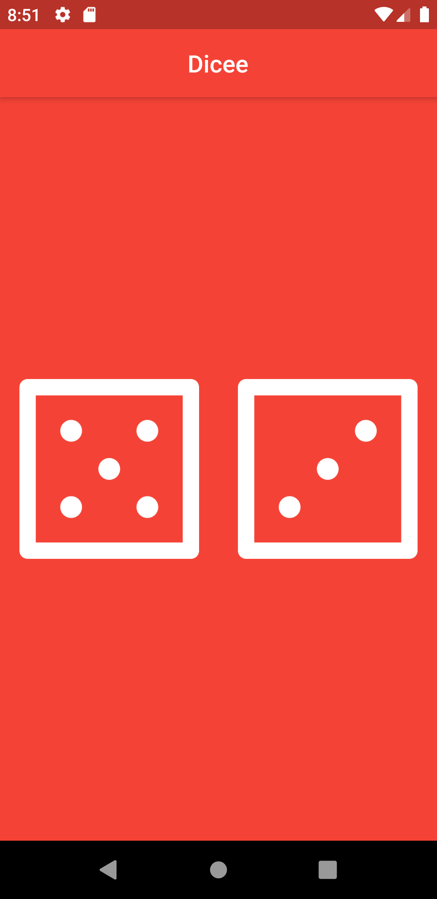
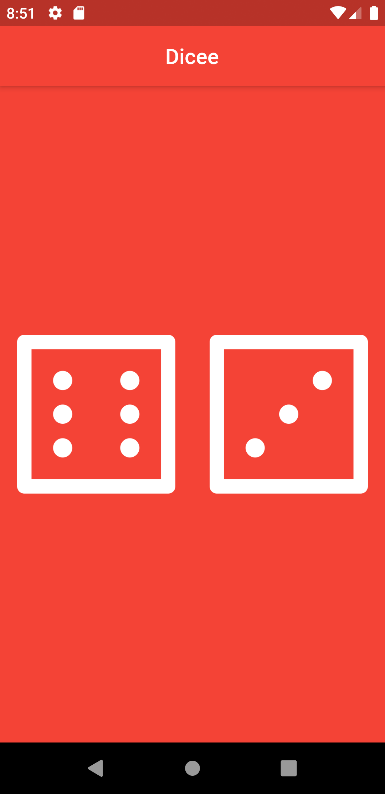

# Dicee 🎲

* A basic game in flutter where the dice rolls when the dice gets clicked.
* Though not so productive,but is a good app to learn basics in flutter.
* The entire application is inspired from the course of *Angela Yu* over flutter availabe on Udemy.
* Check out, fork and share reviews.

## Screenshots:

  

    
  

  

    
  

